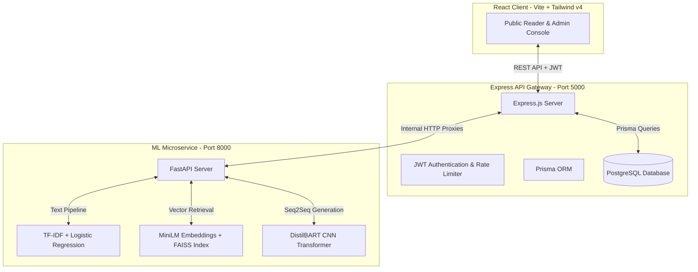

# 🧠 InferaNews – AI-Powered News Intelligence Platform

InferaNews is a modern, full-stack, AI-powered news platform that intelligently processes, enriches, and searches news articles. Using a high-performance **modular microservice architecture**, the platform automates classification, generates real-time abstractive summaries, and performs lightning-fast semantic similarity searches on large volumes of news content.

The system is split into three main components:
*   **React Frontend (Vite):** A high-fidelity, dark-themed, glassmorphic client interface built with **React 19**, **Tailwind CSS v4**, and **Framer Motion** for a premium UX/UI feel.
*   **Express Backend API Gateway:** A secure, high-performance Node.js service using **Prisma ORM** with **PostgreSQL** to manage articles, admin logins, API rate-limiting, and microservice proxy operations.
*   **FastAPI ML Microservice:** A high-speed Python microservice executing heavy NLP model inferences, vector embedding calculations, and spatial proximity searches.

---

## 🏗️ System Architecture

The following diagram illustrates how requests flow seamlessly between the frontend client, the Node.js database layer, and the FastAPI machine learning pipelines:



---

## ⚙️ Tech Stack

### 💻 Frontend Client
*   **Core:** React 19, Vite (HMR-enabled)
*   **Styling:** Tailwind CSS v4, Lucide Icons, HSL-based Custom Dark Palette
*   **State & Queries:** TanStack React Query v5, Axios
*   **Routing:** React Router v7
*   **Animations:** Framer Motion (micro-animations, spring-based transitions)

### 🛡️ Backend Gateway
*   **Runtime:** Node.js, Express.js (v5)
*   **Database ORM:** Prisma Client (`@prisma/client`)
*   **Database:** PostgreSQL
*   **Security:** JWT, BcryptJS, Helmet, Express Rate Limit, CORS

### 🧠 Machine Learning Microservice
*   **Framework:** Python 3.10+, FastAPI, Uvicorn
*   **Classification:** Scikit-learn (TF-IDF Vectorizer + Logistic Regression)
*   **Vector Database:** FAISS CPU (IVF Index with Voronoi cell partitioning)
*   **Summarization:** Hugging Face Transformers (`sshleifer/distilbart-cnn-6-6` model)
*   **Embeddings:** Sentence Transformers (`all-MiniLM-L6-v2` dense vector representations)

---

## 🧠 AI & NLP Capabilities

### 1. Automated Text Classification
*   **Primary Pipeline:** Preprocesses text, generates TF-IDF vectors, and applies a trained **Logistic Regression** model on `(Headline + Short Description)` to categorize the news.
*   **Fallback Logic:** If offline or the model is not found, it runs an intelligent keyword-based matcher categorizing articles into *Business*, *Technology*, *Science*, or *Politics*.

### 2. Real-Time Abstractive Summarization
*   **Primary Pipeline:** Uses the **DistilBART CNN** seq2seq model to generate concise, highly coherent summaries from full-length articles (up to 1,024 tokens).
*   **Fallback Logic:** Uses a sentence-splitting regex routine to extract the first three key sentences (capped at 300 characters) prefixed with `[AI Fallback Summary]`.

### 3. Semantic Similarity Search
*   **Primary Pipeline:** Encodes query titles/descriptions into dense vector representations using `all-MiniLM-L6-v2`. It then queries a high-speed **FAISS index** using `nprobe = 10` for the top-K nearest neighbors.
*   **Fallback Logic:** Conducts a local word-overlapping relevance check against indexed text corpuses, falling back to a structured mock portfolio if index files are empty.

---

## 📁 Directory Structure

```text
InferaNews/
│
├── backend/                  # Node.js API Gateway
│   ├── prisma/               # Prisma Schema (PostgreSQL)
│   ├── src/
│   │   ├── config/           # Database connections & environment configurations
│   │   ├── controllers/      # Route controllers (Auth, Articles, ML proxies)
│   │   ├── middleware/       # Auth guards, Rate limiters, Error handlers
│   │   ├── routes/           # Express API endpoints
│   │   ├── services/         # Microservice API connector
│   │   └── server.js         # Backend Entry point
│   ├── .env.example
│   └── API_DOCS.md           # Backend REST API specification
│
├── frontend/                 # React SPA
│   ├── public/               # Static assets
│   ├── src/
│   │   ├── components/       # Shared layout components (Navbar, Cards, Alerts)
│   │   ├── context/          # Authentication state context
│   │   ├── layouts/          # Page wrappers
│   │   ├── pages/            # Public & Admin pages (Dashboard, Analyze, Search)
│   │   ├── index.css         # Modern Tailwind styles
│   │   └── main.jsx          # React app mount
│   └── package.json
│
└── ml_services/              # Python FastAPI service
    ├── app/
    │   ├── models/           # Local ML models (.pkl, .index binaries)
    │   ├── services/         # Inference scripts (Classifier, Similarity, Summarizer)
    │   ├── config.py         # App environment config
    │   └── main.py           # FastAPI router setup
    ├── requirements.txt
    └── ML_SERVICE_OVERVIEW.md # Detailed ML architecture and setup guide
```

---

## 🚀 Getting Started (Local Setup)

Follow these steps to spin up the entire InferaNews stack locally.

### 📋 Prerequisites
*   **Node.js** (v18+) & **npm** (v9+)
*   **Python** (3.10+) & **pip**
*   **PostgreSQL** instance (local server or cloud service like NeonDB)

---

### Step 1: Set up the FastAPI ML Microservice

1.  Navigate into the `ml_services` directory:
    ```bash
    cd ml_services
    ```
2.  Create and activate a Python virtual environment:
    ```bash
    python -m venv venv
    # On Windows:
    .\venv\Scripts\activate
    # On macOS/Linux:
    source venv/bin/activate
    ```
3.  Install the required dependencies:
    ```bash
    pip install -r requirements.txt
    ```
4.  Ensure your model files are loaded. In your local workspace, the files must reside inside `app/models/`:
    *   `logistic_regression_model.pkl` (Classifier)
    *   `tfidf_vectorizer.pkl` (Classifier Vectorizer)
    *   `faiss.index` (FAISS similarity vector index)
    *   `texts.pkl` (FAISS source reference texts)
5.  Start the microservice using Uvicorn:
    ```bash
    uvicorn app.main:app --port 8000 --reload
    ```
    *   The service will run at `http://127.0.0.1:8000`
    *   You can access the interactive Swagger documentation at `http://127.0.0.1:8000/docs`

---

### Step 2: Set up the Express Backend Gateway

1.  Navigate to the `backend` directory:
    ```bash
    cd ../backend
    ```
2.  Install the Node dependencies:
    ```bash
    npm install
    ```
3.  Configure your environment variables:
    *   Create a `.env` file from the provided example:
        ```bash
        cp .env.example .env
        ```
    *   Update `DATABASE_URL` with your PostgreSQL connection string.
    *   Ensure the `ML_SERVICE_URL` is set to `http://localhost:8000` (FastAPI).
4.  Run Prisma database migrations and generate the client:
    ```bash
    npx prisma migrate dev --name init
    npx prisma generate
    ```
5.  Start the backend server in development mode:
    ```bash
    npm run dev
    ```
    *   The server will start on port `5000` (`http://localhost:5000`)
    *   **Note:** During startup, Prisma will automatically seed the default admin account:
        *   **Username:** `admin`
        *   **Password:** `admin123` (Change this upon logging in)

---

### Step 3: Set up the React Frontend Client

1.  Navigate to the `frontend` directory:
    ```bash
    cd ../frontend
    ```
2.  Install dependencies:
    ```bash
    npm install
    ```
3.  Start the Vite development server:
    ```bash
    npm run dev
    ```
    *   The client application will spin up at `http://localhost:5173`
    *   Open your browser to start reading or publishing news!

---

## 📡 REST API Summary

### Public Client Endpoints
*   `GET /api/v1/articles` → Get paginated, category-filtered, newest-first articles.
*   `GET /api/v1/articles/:id` → Retrieve article details (including similar articles derived from ML).
*   `GET /api/v1/articles/search?q=<keyword>` → Full-text search across titles, descriptions, and content.
*   `POST /api/v1/ml/public/summarize` → Sandbox summarizer (Rate-limited, max 5,000 chars input).
*   `POST /api/v1/ml/public/similar` → Sandbox similarity search (Rate-limited, max 1,000 chars input).

### Admin / Protected Endpoints (Requires `Authorization: Bearer <JWT>`)
*   `POST /api/v1/auth/login` → Authenticates admin and returns a JWT token.
*   `POST /api/v1/articles` → Creates and publishes an article. Automatically enriches content via ML-based auto-categorization and auto-summarization before persisting.
*   `PUT /api/v1/articles/:id` → Edits an existing article.
*   `DELETE /api/v1/articles/:id` → Deletes an article from PostgreSQL.
*   `POST /api/v1/ml/admin/classify` → Direct classifier endpoint.
*   `POST /api/v1/ml/admin/summarize` → High-limit text summarization wrapper.
*   `POST /api/v1/ml/admin/similar` → Vector similarity nearest neighbor search.

---

## 👨‍💻 Key Design Features
*   **Glassmorphic Dark UI Theme:** Clean layouts using tailwind, HSL values, customized borders, backdrop-blur effects, and deep shadow dynamics.
*   **Fully-Featured ML Sandbox:** The "Analyze" tab allows direct interactions with summarization and vector modeling pipelines without registering.
*   **Active Microservice Health Checks:** If the ML API is unreachable, the Express gateway automatically rolls back to robust localized rule-based fallbacks ensuring 100% uptime.
*   **Automated Enrichment Pipeline:** Creating news articles in the admin console triggers automated categorization and abstract summarization, cutting down editorial overhead to zero.
